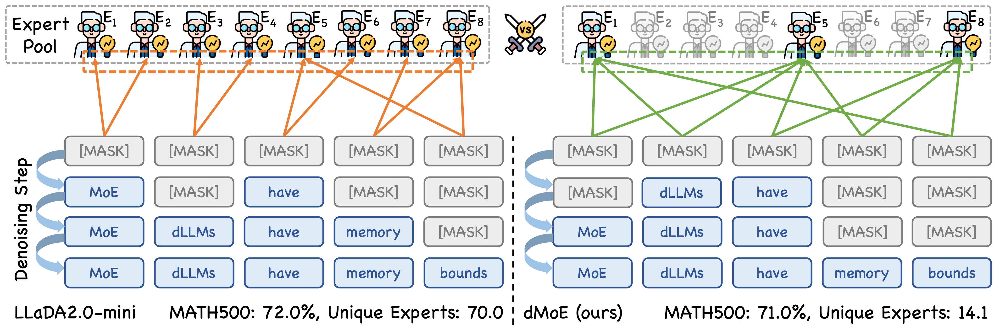

<div align="center">
      <h2><b> dMoE: dLLMs with Learnable Block Experts </b></h2>
</div>

<div align="center">


<a href="todo" target="_blank"></a>
<a href="https://huggingface.co/FSCCS/dMoE-16B" target="_blank"></a>

</div>

https://github.com/user-attachments/assets/fb2fb91d-5d25-4cb1-8d46-2f2fe4248f05

> **[dMoE: dLLMs with Learnable Block Experts](todo)** \
> [Sicheng Feng](https://fscdc.github.io/)<sup>1</sup>, [Zigeng Chen](https://czg1225.github.io/chenzigeng99/)<sup>1</sup>, [Gongfan Fang](https://fangggf.github.io/)<sup>1</sup>, [Xinyin Ma](https://horseee.github.io/)<sup>1</sup>, [Xinchao Wang](https://sites.google.com/site/sitexinchaowang/)<sup>1,*</sup> \
> <sup>1</sup>National University of Singapore, Singapore \
> <sup>∗</sup>Corresponding author: xinchao@nus.edu.sg

---

## ⭐ Updates

- **[4.26.2026]**: Code and model are released. ArXiv submission is on hold; paper preview available [here](assets/arxiv_1.pdf).

---

## 💪 Highlights

- **Learnable Block Experts**: Introduces block-level MoE routing into dLLMs, drastically compressing the number of activated unique experts across diffusion steps — directly targeting memory footprint reduction.
- **Reduced MoE Bandwidth**: By constraining expert activation at the block level, dMoE significantly reduces memory bandwidth consumed by expert weight loading during the block diffusion process.
- **Improved Efficiency-Accuracy Trade-off**: dMoE achieves competitive performance on reasoning and general benchmarks while reducing unnecessary computation through adaptive expert activation.
- **Plug-and-play on LLaDA-2.0**: Built directly on top of LLaDA-2.0-mini without architectural changes, enabling straightforward extension to other masked dLLMs.

---

## 📚 Table of Contents

- [💡 Introduction](#-introduction)
- [💻 Model and Datasets](#-model-and-datasets)
- [🚀 Quick Start](#-quick-start)
- [🔧 Installation](#-installation)
- [🔥 Training](#-training)
- [⚡ Evaluation](#-evaluation)
- [☀️ Acknowledgement](#-acknowledgement)
- [📖 Citation](#-citation)

---

## 💡 Introduction

We present **dMoE**, a framework that introduces Learnable Block Experts into diffusion large language models (dLLMs).



---

## 💻 Model and Datasets

| Model | Description | Source Model | Link |
|-------|-------------|--------------|------|
| 🤖 dMoE-16B | General-purpose dLLM with learnable block experts | LLaDA-2.0-mini | [Hugging Face](https://huggingface.co/FSCCS/dMoE-16B) |

<!-- | Dataset | Description | Link |
|---------|-------------|------|
| 📊 dMoE-Training-Data | Coming soon | Coming soon | -->

---

## 🚀 Quick Start

```bash
git clone https://github.com/fscdc/dMoE.git
cd dMoE

conda create -n dmoe python==3.12
conda activate dmoe
pip install -r ./evaluations/requirements.txt
```

```python
import torch
from transformers import AutoTokenizer
from evaluations.models.modeling_llada2_moe_be_adaptive import LLaDA2MoeModelLM

MODEL_NAME = "FSCCS/dMoE-16B"

device = "cuda:0"

model = LLaDA2MoeModelLM.from_pretrained(
    MODEL_NAME, trust_remote_code=True, torch_dtype=torch.bfloat16
).to(device).eval()

tokenizer = AutoTokenizer.from_pretrained(MODEL_NAME, trust_remote_code=True)

prompt = "A robe takes 2 bolts of blue fiber and half that much white fiber. How many bolts in total does it take?" + "\nLet's think step by step\n"

messages = [[{"role": "user", "content": prompt}]]
input_text = tokenizer.apply_chat_template(messages, add_generation_prompt=True, tokenize=False)

inputs = tokenizer(input_text, return_tensors="pt", padding_side="left")
input_ids = inputs["input_ids"].to(device)

with torch.no_grad():
    out, unique_experts_count = model.generate(
        input_ids,
        steps=32,
        gen_length=2048,
        block_length=32,
        temperature=0.0,
        eos_early_stop=True,
    )

generated = out[:, input_ids.shape[1]:]
result = tokenizer.batch_decode(generated, skip_special_tokens=True)

print("Output:", result[0])
print("Unique experts count:", unique_experts_count)
```

---

## 🔧 Installation

Clone the dMoE repository:

```bash
git clone https://github.com/fscdc/dmoe.git --recursive
cd dmoe
```

Install the **training** environment (based on dFactory):

```bash
cd training
conda create -n dmoe-training python==3.12
conda activate dmoe-training
pip install -e VeOmni/
```

Install the **evaluation** environment:

```bash
cd evaluations
conda create -n dmoe python==3.12
conda activate dmoe
pip install -r requirements.txt
```

---

## 🔥 Training

Our training pipeline is based on [dFactory](https://github.com/inclusionAI/dFactory).

```bash
cd training
```

### 1. Download and Merge Model Weights

Download the base model and convert it to the merged-expert format required for training:

```bash
# Download the original LLaDA-2.0-mini weights
python scripts/download_hf_model.py \
  --repo_id inclusionAI/LLaDA2.0-mini \
  --local_dir /path/to/separate_expert_model

# Convert to merged format for training
python scripts/moe_convertor.py \
  --input-path /path/to/separate_expert_model \
  --output-path /path/to/merged4moe/LLaDA2.0-mini \
  --mode merge
```

### 2. Prepare Training Data

```bash
# gsm8k as an example
python scripts/build_gsm8k_dataset.py
```

### 3. Modify Training Config

Edit `configs/moe/llada2_mini_adaptive.yaml`:

```yaml
model:
  model_path: "/path/to/merged4moe/LLaDA2.0-mini"
  tokenizer_path: "/path/to/merged4moe/LLaDA2.0-mini"
data:
  train_path: "/your/data/path"
train:
  output_dir: "/your/output/path"
```

### 4. Run Training

```bash
PYTHONPATH=$(pwd)/VeOmni:$PYTHONPATH sh train.sh tasks/train_llada2_bd.py configs/moe/llada2_mini_adaptive.yaml
# Or
bash scripts_moe/train_adaptive.sh
```

### 5. Convert the Checkpoint

After training, convert the checkpoint back to the standard MoE format:

```bash
python scripts/moe_convertor.py \
  --input-path ./logs/llada2_mini_dmoe/checkpoints/global_step_XXX/hf_ckpt/ \
  --output-path /path/to/output/llada2_mini_dmoe \
  --mode split
```

---

## ⚡ Evaluation

```bash
cd evaluations
```

### Evaluate dMoE (Adaptive Block Experts)

Set `--model-name` to your local model path in `scripts_moe/run_be_adaptive.sh`, then run:

```bash
bash scripts_moe/run_be_adaptive.sh
```

This evaluates on four benchmarks:
- ✅ GSM8K
- ✅ MATH500
- ✅ MMLU
- ✅ ARC-C

### Evaluate Baseline (Original LLaDA-2.0-mini)

```bash
bash scripts_moe/run_origin.sh
```

---

## ☀️ Acknowledgement

We sincerely thank Huawei for their support and contribution to the research and development of this model and algorithm. Furthermore, our code builds on [dFactory](https://github.com/inclusionAI/dFactory). We acknowledge these great works for laying the groundwork that made our approach possible.

---

## 📖 Citation

If our research assists your work, please give us a star ⭐ or cite us using:

```bibtex
@article{feng2026dmoe,
  title={dMoE: dLLMs with Learnable Block Experts},
  author={Feng, Sicheng and Chen, Zigeng and Fang, Gongfan and Ma, Xinyin and Wang, Xinchao},
  journal={arXiv preprint arXiv:TODO},
  year={2026}
}
```
